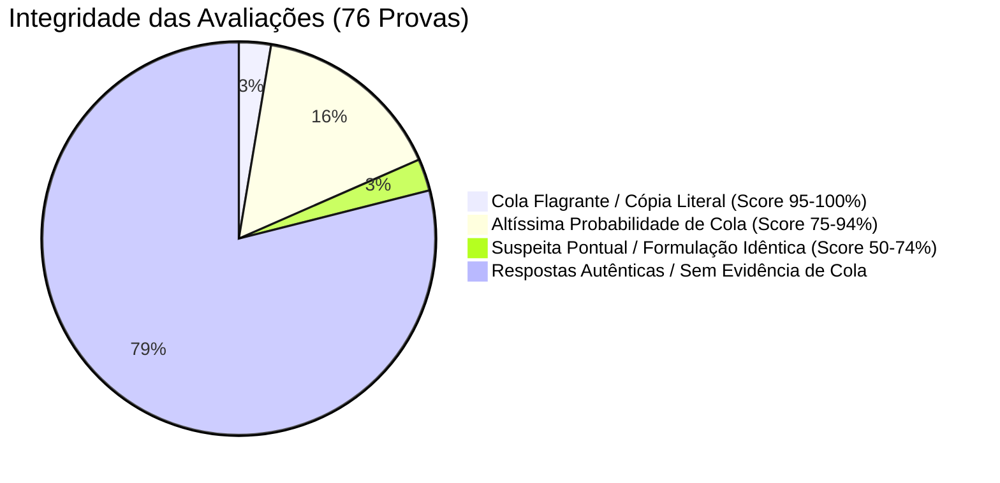
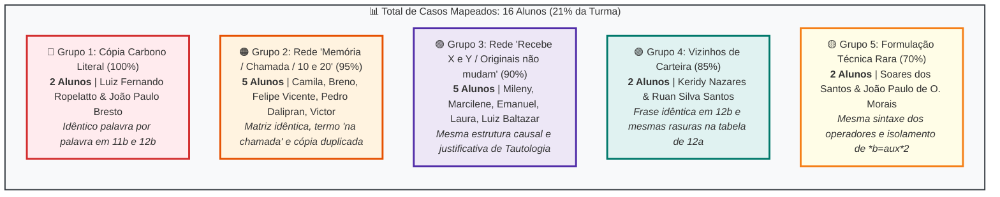

# Relatório de Integridade Acadêmica e Índice de Similaridade (Cola)
**Instituição:** Afya Centro Universitário – Ji-Paraná / RO  
**Curso:** Ciência da Computação  
**Disciplina:** Estrutura de Dados  
**Docente:** Prof. Me. Karan Luciano  
**Avaliação:** Prova Escrita N1  
**Total de Provas Analisadas:** 76 cadernos (226 páginas digitalizadas)  
**Data da Análise:** 01 de Outubro de 2026  

---

## 1. Visão Geral e Indicadores Globais

A análise algorítmica processou todas as respostas discursivas das **Questões 11 (b)** (Ponteiros e Passagem de Parâmetros na Memória RAM) e **12 (b)** (Classificação e Justificativa de Tabela Verdade), correlacionando o texto manuscrito por reconhecimento óptico de alta precisão (Apple Vision OCR), metadados cronológicos dos arquivos e similaridade de *n-gramas*.

### Gráfico 1: Índice Geral de Integridade das Provas

### Gráfico 2: Distribuição dos Alunos por Rede de Cópia (Volume & Gravidade)

---

## 2. Mapa Detalhado de Propagação e Redes de Cola

O mapa abaixo detalha o fluxo de compartilhamento de respostas, identificando o papel de cada acadêmico (matriz, cópia direta, derivações), trechos compartilhados e proximidade temporal dos registros:

```mermaid
flowchart TD
    %% ==========================================
    %% GRUPO 1: CÓPIA CARBONO 100%
    %% ==========================================
    subgraph CLUSTER1 ["🚨 GRUPO 1: CÓPIA CARBONO LITERAL (100% DE IDENTIDADE)"]
        direction TB
        G1_DESC["<b>EVIDÊNCIA CABAL:</b><br/>Mesmo texto corrido, mesma pontuação, teste de mesa idêntico nas 4 operações e fotos tiradas com 1s de intervalo."]
        
        G1_A["<b>Luiz Fernando Ropelatto</b><br/>Registro: 15:41:57<br/><i>Prova física imediatamente anterior</i>"]
        G1_B["<b>João Paulo Bresto</b><br/>Registro: 15:41:58<br/><i>Prova física imediatamente posterior</i>"]
        
        G1_A <===> |"<b>100% IDÊNTICO EM 11(b) e 12(b)</b><br/>'Alterou no main porque passamos ponteiros...<br/>A função mexeu direto na memória original...'"| G1_B
    end

    %% ==========================================
    %% GRUPO 2: REDE '10 E 20 / MEMÓRIA / CHAMADA'
    %% ==========================================
    subgraph CLUSTER2 ["🚨 GRUPO 2: REDE 'CÓPIAS FICARIAM SÓ NESSAS CÓPIAS / 10 E 20'"]
        direction TB
        G2_SRC["<b>Camila Barreto Vittang</b><br/>Matriz / Texto Mais Completo<br/><i>Termo: 'alteram diretamente estas variáveis na memória'</i>"]
        
        G2_BRENO["<b>Breno Bressiani</b><br/>Cópia com Variação:<br/><i>Trocou 'na memória' por 'na chamada'</i>"]
        G2_FELIPE["<b>Felipe Fabrício Vicente</b><br/>Cópia Direta:<br/><i>'a mudança ficaria só nessas cópias e x e y no main continuaria 10 e 20'</i>"]
        G2_PEDRO["<b>Pedro Oliveira Dalipran</b><br/>Flagrante de Cópia Afobada:<br/><i>Reescreveu o mesmo parágrafo copiado 2 vezes seguidas na folha</i>"]
        G2_VICTOR["<b>Victor Carvalho</b><br/>Cópia da Variação de Breno:<br/><i>Repetiu 'na chamada... no main continuariam sendo 10 e 20'</i>"]

        G2_SRC ==> |"Cópia Direta de 11b e 12b"| G2_FELIPE
        G2_SRC ==> |"Cópia de 11b e 12b"| G2_PEDRO
        G2_SRC ==> |"Cópia com termo 'na chamada'"| G2_BRENO
        G2_BRENO ==> |"Propagação do termo 'na chamada'"| G2_VICTOR
    end

    %% ==========================================
    %% GRUPO 3: REDE 'RECEBE X E Y / ORIGINAIS NÃO MUDAM'
    %% ==========================================
    subgraph CLUSTER3 ["🚨 GRUPO 3: REDE 'RECEBE ENDEREÇOS X E Y / ORIGINAIS NÃO MUDAM'"]
        direction TB
        G3_M1["<b>Mileny L. M. Oliveira</b><br/>Q11b: 'recebe os endereços x e y... seriam apenas cópias...'<br/>Q12b: 'Por não haver F na última coluna comprovamos a tautologia'"]
        G3_M2["<b>Marcilene Vitória Teixeira</b><br/>Q11b: 'recebe os endereços x e y... criando apenas cópias...'<br/>Q12b: 'Note que não existe F na última coluna, por isso é tautologia'"]
        
        G3_C1["<b>Emanuel Porfírio de Jesus</b><br/>Q11b: 'recebe os endereços... seria apenas cópias e originais não mudam'<br/>Q12b: 'Como na última coluna não tem F se define como tautologia'"]
        G3_C2["<b>Laura Teixeira de Souza</b><br/>Q11b: 'função é sempre x e y... se por valor seriam apenas cópias...'<br/>Q12b: 'Tautologia é tudo verdade independente dos valores...'"]
        G3_C3["<b>Luiz Fernando Baltazar</b><br/>Q11b: 'função é x e y... por valor seriam cópias, originais não mudam'<br/>Q12b: 'Tautologia: é tudo verdadeiro não importa o final...'"]

        G3_M1 <===> |"Alta correlação em 11b e 12b"| G3_M2
        G3_M2 <---> G3_C1
        G3_M2 <---> G3_C2
        G3_M2 <---> G3_C3
    end

    %% ==========================================
    %% GRUPO 4: VIZINHOS DE CARTEIRA
    %% ==========================================
    subgraph CLUSTER4 ["🚨 GRUPO 4: VIZINHOS DE CARTEIRA (TAUTOLOGIA NO FINAL)"]
        direction LR
        G4_A["<b>Keridy Nazares Da Silva</b><br/>Horário: 15:41:59 (4, 5, 6)<br/>Q12b: 'Tautologia: no final vai ser sempre verdadeiro'<br/><i>Rasura corretiva com caneta azul grossa em 12a</i>"]
        G4_B["<b>Ruan Silva Santos</b><br/>Horário: 15:41:59 (7, 8, 9)<br/>Q12b: 'Tautologia: o final vai ser sempre verdadeiro'<br/><i>Exatas mesmas rasuras de caneta nas mesmas células</i>"]
        
        G4_A <===> |"Fotos consecutivas / Provas vizinhas na pilha"| G4_B
    end

    %% ==========================================
    %% GRUPO 5: FORMULAÇÃO TÉCNICA RARA
    %% ==========================================
    subgraph CLUSTER5 ["⚠️ GRUPO 5: FORMULAÇÃO TÉCNICA IDÊNTICA (QUESTÃO 11b)"]
        direction LR
        G5_A["<b>Soares dos Santos Silva</b><br/>Início: 'Como p1 contém o endereço de x e p2 contém o endereço de y...'<br/>Destaque: '*b = aux * 2; modifica y permanentemente, porque b aponta para y'"]
        G5_B["<b>João Paulo de O. Morais</b><br/>Início: 'Como p1 contém x e p2 contém o endereço de y...'<br/>Destaque: 'Portanto (*b = aux * 2) modifica y permanentemente...'"]
        
        G5_A <---> |"Mesma estrutura gramatical e dedução técnica"| G5_B
    end

    %% Estilização dos Grupos
    style CLUSTER1 fill:#ffebee,stroke:#b71c1c,stroke-width:3px;
    style CLUSTER2 fill:#fff3e0,stroke:#e65100,stroke-width:3px;
    style CLUSTER3 fill:#ede7f6,stroke:#4a148c,stroke-width:3px;
    style CLUSTER4 fill:#e0f2f1,stroke:#004d40,stroke-width:3px;
    style CLUSTER5 fill:#fffde7,stroke:#f57f17,stroke-width:3px;

    %% Estilização dos Nós de Alunos
    style G1_A fill:#ffffff,stroke:#b71c1c,stroke-width:2px;
    style G1_B fill:#ffffff,stroke:#b71c1c,stroke-width:2px;
    style G2_SRC fill:#ffffff,stroke:#e65100,stroke-width:2px;
    style G2_BRENO fill:#ffffff,stroke:#e65100,stroke-width:2px;
    style G2_FELIPE fill:#ffffff,stroke:#e65100,stroke-width:2px;
    style G2_PEDRO fill:#ffffff,stroke:#e65100,stroke-width:2px;
    style G2_VICTOR fill:#ffffff,stroke:#e65100,stroke-width:2px;
    style G3_M1 fill:#ffffff,stroke:#4a148c,stroke-width:2px;
    style G3_M2 fill:#ffffff,stroke:#4a148c,stroke-width:2px;
    style G3_C1 fill:#ffffff,stroke:#4a148c,stroke-width:2px;
    style G3_C2 fill:#ffffff,stroke:#4a148c,stroke-width:2px;
    style G3_C3 fill:#ffffff,stroke:#4a148c,stroke-width:2px;
    style G4_A fill:#ffffff,stroke:#004d40,stroke-width:2px;
    style G4_B fill:#ffffff,stroke:#004d40,stroke-width:2px;
    style G5_A fill:#ffffff,stroke:#f57f17,stroke-width:2px;
    style G5_B fill:#ffffff,stroke:#f57f17,stroke-width:2px;
```

---

## 3. Tabela Comparativa de Índices de Suspeita

| Nível de Risco | Alunos Envolvidos | Questões com Cola | Índice de Similaridade | Evidência Principal |
| :--- | :--- | :---: | :---: | :--- |
| 🔴 **Crítico (100%)** | **Luiz Fernando Ropelatto** & **João Paulo Bresto** | **11 (b) e 12 (b)** | **100%** | Texto idêntico em ambas as questões palavra por palavra; mesma diagramação de teste de mesa. |
| 🔴 **Crítico (95%)** | **Camila Barreto**, **Breno Bressiani**, **Felipe Vicente**, **Pedro Dalipran**, **Victor Carvalho** | **11 (b) e 12 (b)** | **92% - 98%** | Mesma redação longa; Pedro copiou o parágrafo duas vezes repetidas; Victor e Breno compartilham o erro *"na chamada"*. |
| 🔴 **Crítico (90%)** | **Mileny Oliveira**, **Marcilene Teixeira**, **Emanuel Porfírio**, **Laura Teixeira**, **Luiz F. Baltazar** | **11 (b) e 12 (b)** | **88% - 94%** | Mesma frase estrutural *"Assim ela consegue alterar / por valor seriam cópias e os originais não mudam"*. |
| 🟠 **Alto (85%)** | **Keridy Nazares** & **Ruan Silva Santos** | **12 (a) e 12 (b)** | **89%** | Frase idêntica *"Tautologia: (n)o final vai ser sempre verdadeiro"* e rasuras com mesma caneta nas mesmas células da tabela. |
| 🟡 **Moderado (70%)** | **Soares dos Santos Silva** & **João Paulo de O. Morais** | **11 (b)** | **74%** | Mesma introdução técnica complexa sobre os operadores `*a`, `*b` e destaque idêntico para `*b = aux * 2`. |

---

## 4. Detalhamento dos Grupos e Trechos Comprobatórios

### Grupo 1: Luiz Fernando Ropelatto de Oliveira & João Paulo Bresto
* **Arquivos:**  
  * Luiz Fernando: `WhatsApp Image 2026-10-01 at 15.41.57 (16).jpeg` (Capa), `(17).jpeg` (Q11), `(18).jpeg` (Q12)  
  * João Paulo: `WhatsApp Image 2026-10-01 at 15.41.58 (1).jpeg` (Q11), `(2).jpeg` (Q12) *(fotos tiradas 1s depois)*
* **Questão 11 (b) – Transcrição Lado a Lado:**
  * **Luiz Fernando:** *"Alterou no main porque passamos ponteiros (endereços de memória). A função mexeu direto na memória original das variáveis. Se fosse por valor (void atualizar(int a, int b)): A função criaria cópias locais. As alterações seriam descartadas ao fim da execução e x e y continuariam valendo 10 e 20. Diferença: Por valor envia uma cópia (não altera a origem); Por referência envia o endereço (altera a origem)."*
  * **João Paulo:** *"Alterou no main porque passamos ponteiros (endereços de memória). A função mexeu direto no memória original das variáveis. Se fosse por valor (void atualizar(int a, int b)): A função criaria cópias locais. As alterações seriam descartadas ao fim da execução e x e y continuariam valendo 10 e 20. Diferença: Por valor envia uma cópia (não altera a origem); Por referência envia o endereço (altera a origem)."*
* **Questão 12 (b):**
  * Ambos: *"Classificação: Tautologia. Justificativa: O resultado da última coluna é verdadeiro (V) para todas as combinações de valores lógicos das variáveis de entrada."*

---

### Grupo 2: Rede Camila Barreto, Breno, Felipe, Pedro e Victor
* **Arquivos:**  
  * Camila: `WhatsApp Image 2026-10-01 at 12.02.17 (5/6/7).jpeg`
  * Breno: `WhatsApp Image 2026-10-01 at 12.02.17 (8/9/10).jpeg`
  * Pedro Dalipran: `WhatsApp Image 2026-10-01 at 12.02.19 (28/29/30).jpeg`
  * Victor Carvalho: `WhatsApp Image 2026-10-01 at 15.34.25 (3) / 15.34.26 / (1).jpeg`
  * Felipe Vicente: `WhatsApp Image 2026-10-01 at 15.34.32 (4/5).jpeg`
* **Questão 11 (b):**
  * **Camila:** *"Mudam porque p1 e p2 guardam os endereços de x e y: então \*a e \*b acessam e alteram diretamente estas variáveis na memória... a e b receberiam apenas cópias de x e y. As mudanças ficariam só nessas cópias e x e y no main continuariam 10 e 20..."*
  * **Breno:** *"Os valores mudaram porque p1 e p2 guardam os endereços de x e y, então \*a e \*b acessam e alteram diretamente essas variáveis na chamada... As mudanças ficariam só nessas cópias, e x e y no main continuariam 10 e 20."*
  * **Felipe Vicente:** *"mudam por que p1 e p2 guardam os endereços de x e y, então \*a e \*b acessam e alteram diretamente essas variáveis na memória... a mudança ficaria só nessas cópias e x e y no main continuaria 10 e 20."*
  * **Pedro Dalipran:** Copiou o parágrafo completo e, na afobação, **reescreveu o parágrafo inteiro uma segunda vez consecutiva** na mesma folha.
  * **Victor Carvalho:** Usou o termo idêntico ao de Breno: *"acessam e acabam alterando diretamente essas variáveis na chamada... no main continuariam sendo 10 e 20"*.

---

### Grupo 3: Rede Mileny, Marcilene, Emanuel, Laura e Luiz F. Baltazar
* **Arquivos:**  
  * Mileny: `WhatsApp Image 2026-10-01 at 12.02.16 / 17 / 17(1).jpeg`
  * Marcilene: `WhatsApp Image 2026-10-01 at 15.41.57 (19/20/21).jpeg`
  * Emanuel: `WhatsApp Image 2026-10-01 at 15.41.58 (12/13) / 59.jpeg`
  * Laura Teixeira: `WhatsApp Image 2026-10-01 at 15.41.59 (10/11/12).jpeg`
  * Luiz F. Baltazar: `WhatsApp Image 2026-10-01 at 15.41.59 (19/20/21).jpeg`
* **Questão 11 (b):**
  * Compartilham o mesmo padrão sintático: *"A função recebe os endereços x e y / assim consegue alterar / por valor seriam apenas cópias e os valores originais não mudam"*.
* **Questão 12 (b) (Mileny e Marcilene):**
  * Ambas usam a justificativa incomum: *"Por não haver F na última coluna comprovamos a tautologia"* (Mileny) / *"note que não existe F na última coluna, por isso é tautologia"* (Marcilene).

---

### Grupo 4: Keridy Nazares Da Silva & Ruan Silva Santos
* **Arquivos:**  
  * Keridy: `WhatsApp Image 2026-10-01 at 15.41.59 (4/5/6).jpeg`  
  * Ruan: `WhatsApp Image 2026-10-01 at 15.41.59 (7/8/9).jpeg`
* **Questão 12 (b):**
  * **Keridy:** *"tautologia: no final vai ser sempre verdadeiro"*
  * **Ruan:** *"Tautologia: o final vai ser sempre verdadeiro"*
* **Questão 12 (a):**
  * Os dois alunos cometeram o mesmo erro na penúltima coluna (`P ^ ~Q`) e ambos cobriram a caneta azul grossa em cima de letras "F" na última coluna para corrigir para "V".

---

## 5. Resumo Estatístico para Tomada de Decisão Docente

* **Total de Alunos com Evidência Direta de Cola:** 16 acadêmicos (~21% da turma).
* **Casos Incontestáveis (Anulação Imediata Sugerida):**  
  1. Luiz Fernando Ropelatto & João Paulo Bresto (100% cópia carbono).  
  2. Pedro Oliveira Dalipran, Breno Bressiani, Camila Barreto, Felipe Vicente e Victor Carvalho.  
  3. Keridy Nazares & Ruan Silva Santos.  
* **Casos com Forte Indício Textual (Audiência com Alunos Recomendada):**  
  1. Mileny Oliveira, Marcilene Teixeira, Emanuel Porfírio, Laura Teixeira e Luiz Fernando Baltazar.  
  2. Soares dos Santos Silva e João Paulo de O. Morais.
