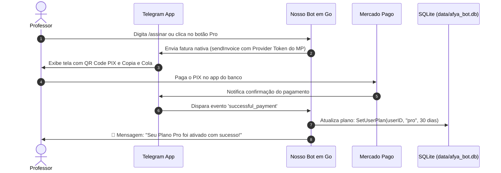

# Guia de Implementação: Pagamentos PIX Automatizados com Mercado Pago no Telegram

> [!NOTE]
> Este documento é o roteiro definitivo para quando você decidir ativar a cobrança 100% automatizada no Telegram Bot, permitindo que professores assinem o **Plano Professor Pro** via PIX e tenham o acesso liberado em segundos, sem necessidade de conferência manual de comprovantes.

---

## 🎯 Como Funciona o Fluxo Automatizado



---

## 🛠️ Passo 1: Conectar o Mercado Pago no @BotFather

O Telegram já possui integração homologada oficial com o Mercado Pago. Todo o processo é feito em menos de 5 minutos:

1. Abra o Telegram e inicie uma conversa com o **[@BotFather](https://t.me/BotFather)**;
2. Envie o comando `/mybots` e selecione o seu bot (`@seu_bot_username`);
3. No menu do bot, clique em **Payments**;
4. Clique em **Connect Mercado Pago Live** (ou *Connect Mercado Pago Test* caso queira testar em ambiente de sandbox primeiro);
5. O @BotFather enviará um link de autorização do Mercado Pago:
   - Clique no link;
   - Faça login na sua conta do Mercado Pago;
   - Autorize a permissão do Telegram para gerar cobranças;
6. Após autorizar, o @BotFather responderá no chat com o seu **Provider Token**:
   ```
   Mercado Pago: 123456789:LIVE:ABCdef123... (ou TEST:...)
   ```
7. Guarde esse token para configurar no `.env`.

---

## ⚙️ Passo 2: Configuração das Variáveis no `.env`

Quando for implementar, adicione as variáveis no seu `.env`:

```env
# Token de pagamentos obtido do @BotFather com o Mercado Pago conectado
TELEGRAM_PAYMENT_PROVIDER_TOKEN=123456789:LIVE:ABCdef123...

# Moeda oficial para cobrança no Brasil (Real)
PAYMENT_CURRENCY=BRL

# Valor do Plano Pro em centavos (ex: 4900 = R$ 49,00)
SUBSCRIPTION_PRICE_CENTS=4900
```

---

## 💻 Passo 3: O que precisa ser implementado no Código em Go

A biblioteca nativa da Telegram Bot API exige apenas dois métodos e dois manipuladores de eventos:

### 1. Envio da Fatura (`sendInvoice`)
Quando o professor digitar `/assinar`, em vez de enviar o texto com a chave PIX manual, o bot chama o endpoint `sendInvoice`:

```go
// Exemplo do payload para enviar a fatura
payload := map[string]any{
    "chat_id": chatID,
    "title": "Assinatura Plano Professor Pro (30 dias)",
    "description": "Correção em lote ilimitada, radar de evasão, questões ENADE e triagem de Inbox.",
    "payload": fmt.Sprintf("sub_pro_%d_%d", userID, time.Now().Unix()),
    "provider_token": os.Getenv("TELEGRAM_PAYMENT_PROVIDER_TOKEN"),
    "currency": "BRL",
    "prices": []map[string]any{
        {"label": "Plano Professor Pro Mensal", "amount": 4900}, // R$ 49,00
    },
}
```

### 2. Confirmação Prévia (`pre_checkout_query`)
Antes de finalizar a cobrança, o Telegram pergunta ao seu bot se está tudo certo com a transação. O bot responde aprovando imediatamente:

```go
func handlePreCheckoutQuery(queryID string) {
    // Responde ok: true para o Telegram liberar o recebimento do PIX
    // POST /answerPreCheckoutQuery com {"pre_checkout_query_id": queryID, "ok": true}
}
```

### 3. Liberação Automática do Acesso (`successful_payment`)
Assim que o professor conclui o PIX no banco dele, o Telegram envia uma mensagem contendo o objeto `successful_payment`:

```go
if msg.SuccessfulPayment != nil {
    telegramID := msg.From.ID
    amountCents := msg.SuccessfulPayment.TotalAmount // ex: 4900

    // Ativa o plano Pro por 30 dias no SQLite
    err := db.SetUserPlan(telegramID, "pro", 30)
    if err != nil {
        log.Printf("Erro ao ativar plano Pro para %d: %v", telegramID, err)
    }

    // Registra o histórico na tabela payments
    // INSERT INTO payments (id, telegram_id, amount_cents, status, paid_at) ...

    // Envia mensagem festiva para o professor
    b.sendTextMessage(chatID, 
        "🎉 *Pagamento Confirmado com Sucesso!*\n\n"+
        "Seu *Plano Professor Pro* foi ativado por 30 dias com requisições ilimitadas.\n"+
        "Obrigado por apoiar nosso assistente pedagógico! Experimente enviar qualquer tarefa do Canvas agora."
    )
}
```

---

## 📊 Custos e Prazos do Mercado Pago

- **Taxa por PIX recebido:** Cerca de **0,99%** no Mercado Pago (em uma assinatura de R$ 49,00, a taxa é de apenas **R$ 0,48**).
- **Prazo de Liberação do Dinheiro:** O dinheiro cai instantaneamente na sua conta do Mercado Pago e pode ser transferido para qualquer banco via PIX na mesma hora.
- **Taxa do Telegram:** O Telegram cobra **0%** de comissão para pagamentos em moedas nacionais (BRL).

---

## 📝 Resumo dos Próximos Passos (Quando for Ativar)

1. [ ] Conectar a conta do Mercado Pago no `@BotFather` (`/mybots` > *Payments*).
2. [ ] Colocar o `TELEGRAM_PAYMENT_PROVIDER_TOKEN` no `.env`.
3. [ ] Chamar o assistente de IA pedindo: *"Ative o fluxo do Mercado Pago no bot do Telegram usando o roteiro em `doc/planejamento/INTEGRACAO_MERCADO_PAGO_TELEGRAM.md`"*.
